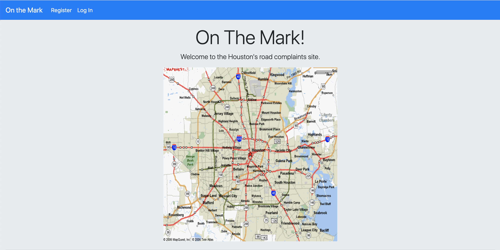
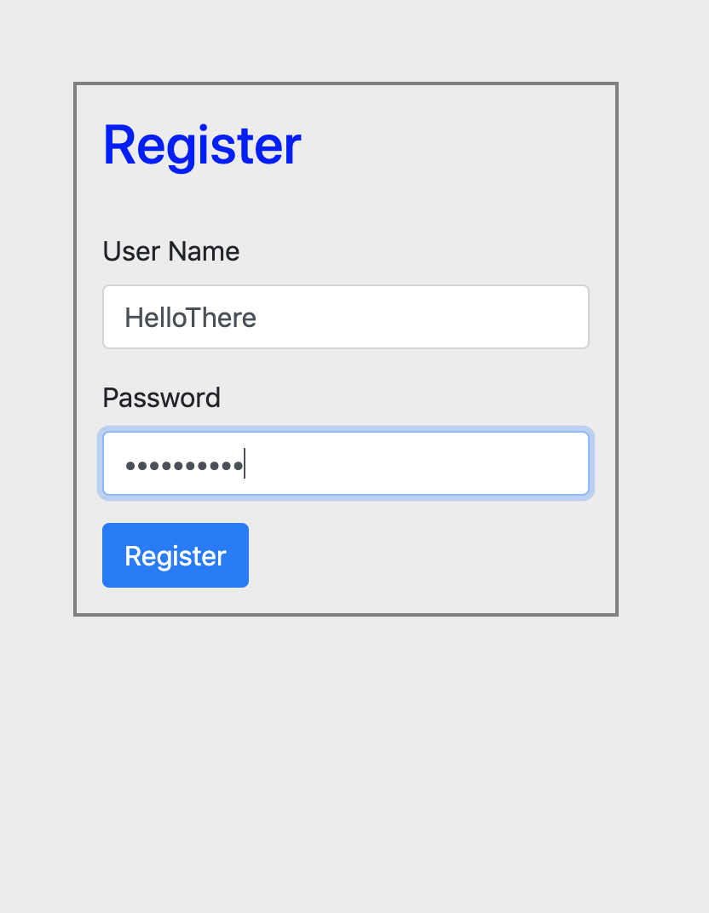
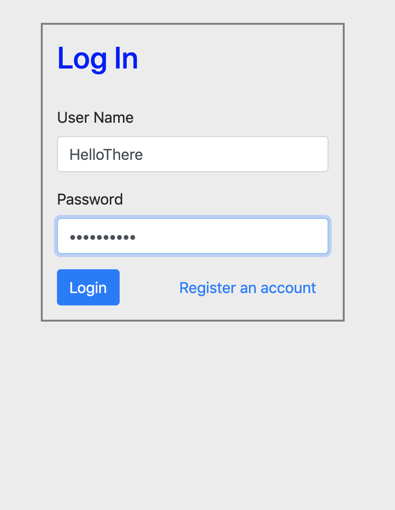
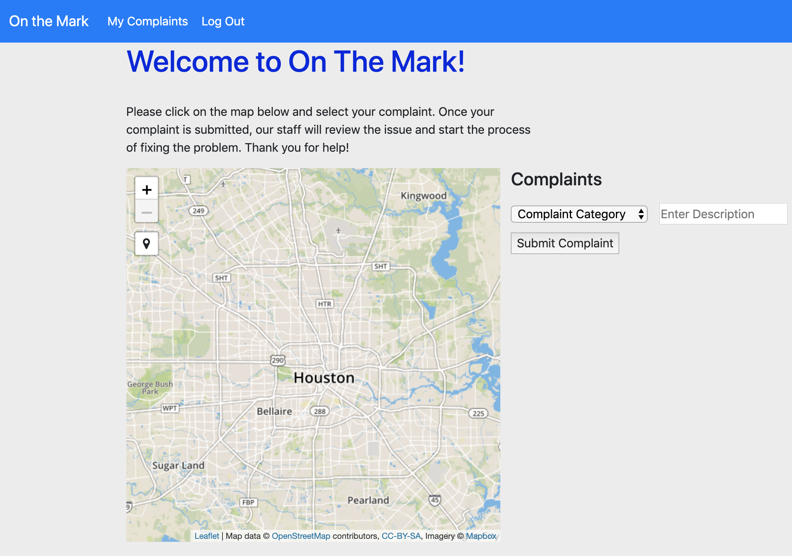
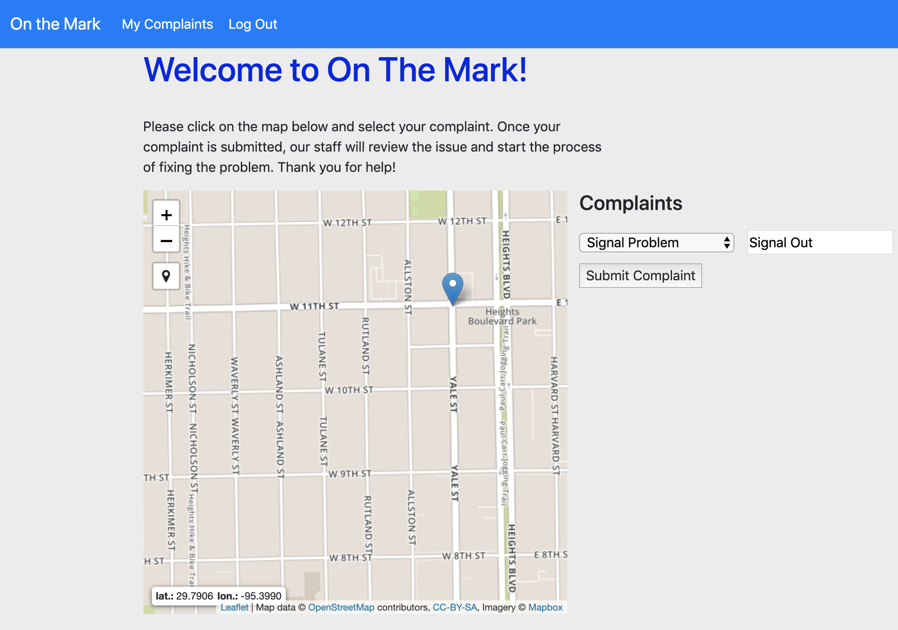
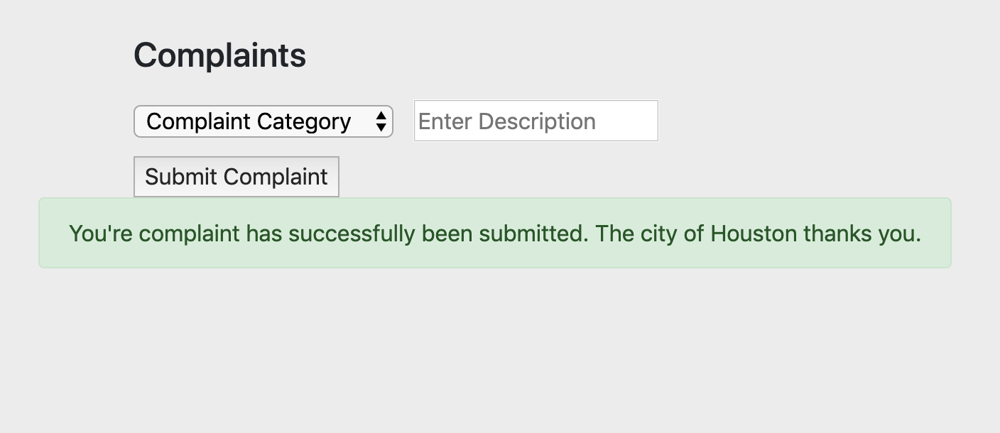
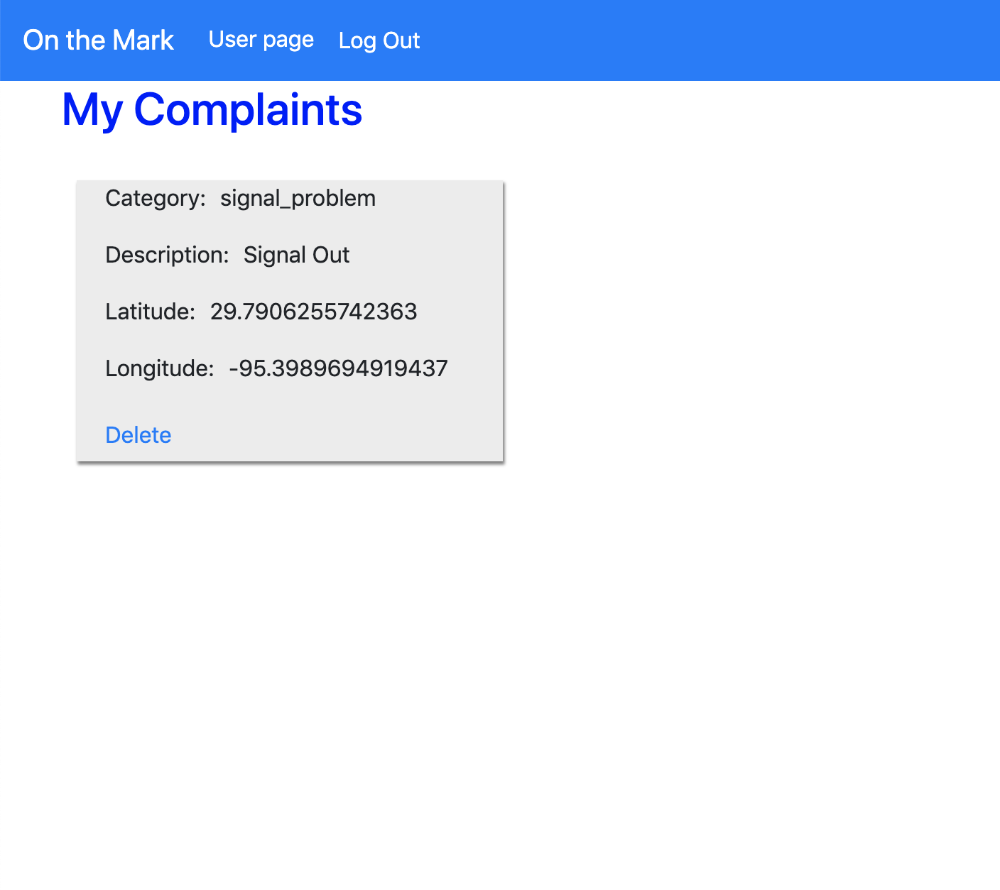
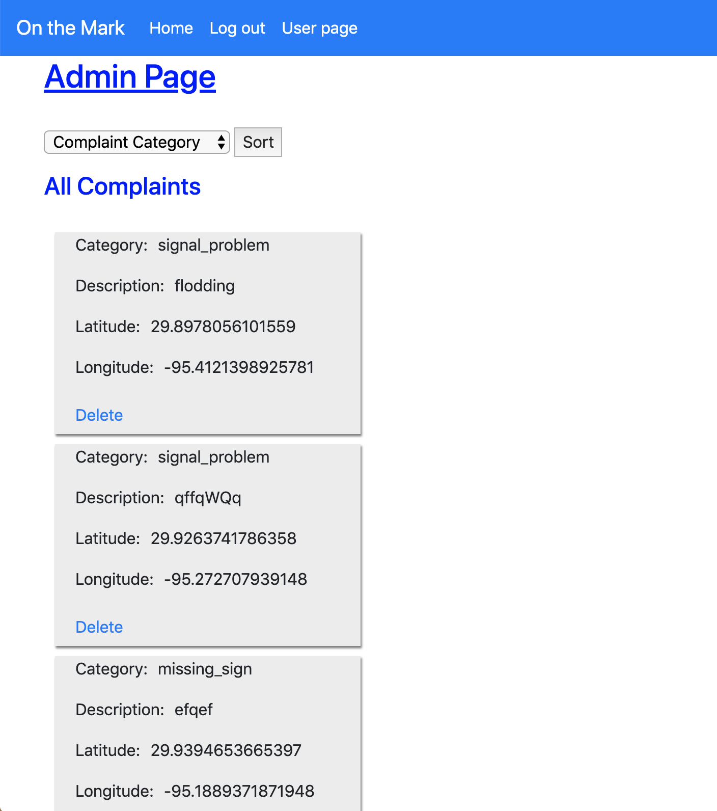
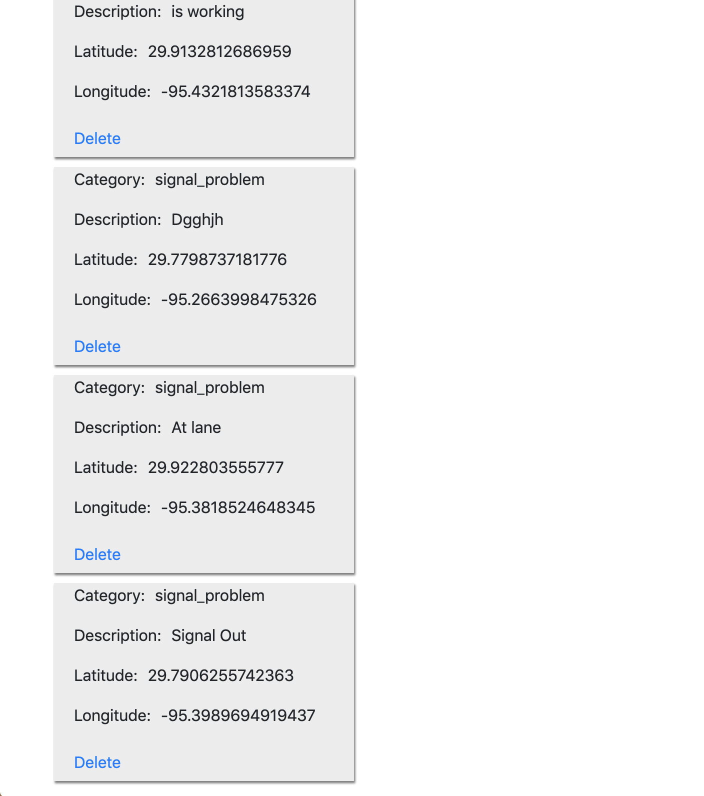
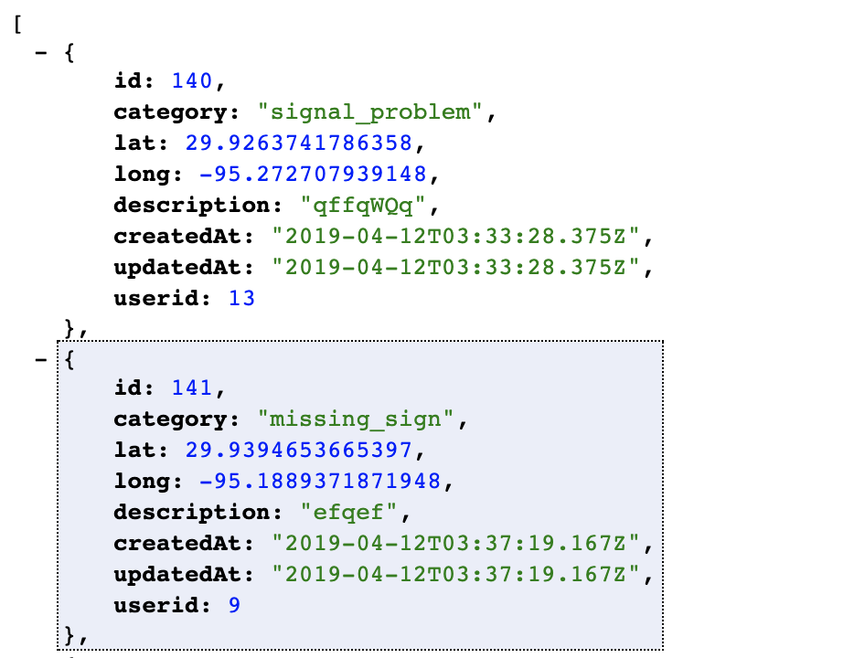

# On the Mark!
**On the Mark! is a website designed by four individuals, Mike, Alpa, Richard, and Kanwal, as a Digital Crafts project.**
The website is live <a href="https://agile-mesa-12521.herokuapp.com/">HERE.</a> 
 
For testing purposes, a user has been set up for visitors. 
**Username:** HelloThere  
**Password:** HelloThere

*Our API is <a href="https://agile-mesa-12521.herokuapp.com/api">live!</a>*

# Watch It In Action

# All Complaints Displaying On Map

# How It Works
**Register and Login**

As you first come to the page, you are directed to the home page with a Houston map and a description of what to expect. Our app allows you to file complaints with the admin about road conditions, traffic lights being down, potholes, flooding, and more. The admin can see complaints as they come in and delete them as they are resolved.

First, let's see how the average user interacts with the app.

You must register in order to use the app, which redirects you straight to the login screen.

Once you are inside, you are presented a functional map which is restricted to the Houston area. 

**Filing a Complaint**

On the main page, you will see an option for My Complaints.
 
 

If we click on this button, we can see all of the complaints we filed which are currently still out for servicing.

As a new user, we do not currently have any complaints filed. Let's go back to the main page and file a complaint.

 

The map constraints can be altered easily, which allows for this app to be functional in any location. The max zoom has been set to prevent users from dropping pins outside of the Houston city area. Since this app is designed with the City of Houston in mind as the admin, having issues from other locations outside of the Houston city area needed to be prevented. As you can see, I am currently outside of the constrains of the map while using the GPS function, and therefore cannot upload my current location into the complaints' database. 

If I zoom in and pick a location inside the confines of the map, I am able to drop a pin and get the location freely.

All we have to do is fill out the information required and click submit. Once submitted, we get a message confirming everything went smoothly.

We go back to check on our complaints...

And we see we have successfully filed a complaint and can retrieve it.

# For the Admin 

Once the admin logs into the website, they are directed to a page only they can see. 

The Admin can see each and every complaint filed from all users in all categories, but this is a lot of information to sort through in order to find one complaint. Using the sort function and scrolling to the bottom of the list (older complaints are presented at the top of the list), we are able to find the complaint we just filed as a user.

The admin is fully able to submit their own complaints, but are able to delete any and all complaints submitted. 

 

# Our API
Our API is working and <a href="https://agile-mesa-12521.herokuapp.com/api">live!</a>  
Make sure to install Google Chrome's JSONView extension for a better viewing experience.

# Future Features 
**Display All Complaints Map Layer**  
**Display Markers By Category**  
**Change Markers By Category Filtering**  
**Username and Password Requirements**  
**Email Integration**  
**"Your complaint is being serviced." "Your complaint has been resolved."**  
